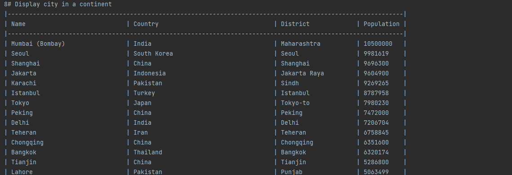
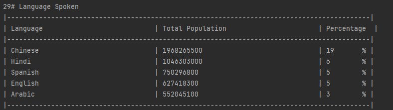

Group-3 
Master Build Status - 
 
Develop Build Status - 
 
Codecov 
 
License 
 
Workflow-
 
Release-

32 requirements of 32 have been implemented, which is 100%

| ID  | Name                                                                          |  Met  | Screenshot                   |
|-----|-------------------------------------------------------------------------------|-------|------------------------------|
 | 1   | All the countries in the world organised by largest population to smallest.   | Yes|   |
| 2   | All the countries in a continent organised by largest population to smallest. | Yes|   |
| 3   | All the countries in a region organised by largest population to smallest.    | Yes|   |
| 4   | The top N populated countries in the world where N is provided by the user.   | Yes|   |
| 5   | The top N populated countries in a continent where N is provided by the user. | Yes|   |
| 6   | The top N populated countries in a region where N is provided by the user.    | Yes|   |
| 7   | All the cities in the world organised by largest population to smallest.      | Yes|   |
| 8   | All the cities in a continent organised by largest population to smallest.    | Yes|   |
| 9   | All the cities in a region organised by largest population to smallest.       | Yes|   |
| 10  | All the cities in a country organised by largest population to smallest.      | Yes|  |
| 11  | All the cities in a district organised by largest population to smallest.     | Yes|  |
| 12  | The top N populated cities in the world where N is provided by the user.      | Yes|  |
| 13  | The top N populated cities in a continent where N is provided by the user.    | Yes|  |
| 14  | The top N populated cities in a region where N is provided by the user.       | Yes|  |
| 15  | The top N populated cities in a country where N is provided by the user.      | Yes|  |
| 16  | The top N populated cities a district where N is provided by the user.        | Yes|  |
| 17  | All the capital cities in the world organised by largest population to smallest. | Yes|  |
| 18  |All the capital cities in a continent organised by largest population to smallest.      | Yes|  |
| 19  | All the capital cities in a region organised by largest to smallest.       | Yes|  |
| 20  |The top N populated capital cities in the world where N is provided by the user.    | Yes|  |
| 21  | The top N populated capital cities in a continent where N is provided by the user.  | Yes|  |
| 22  | The top N populated capital cities in a region where N is provided by the user.    | Yes|  |
| 23  |The population of the world.   | Yes|  |
| 24  |The population of a continent.       | Yes|  |
| 25  | The population of a region.     | Yes|  |
| 26  | The population of a country.    | Yes|  |
| 27  | The population of a district.     | Yes|  |
| 28  | The population of a city.     | Yes|  |
| 29  |  the number of people who speak the following the following languages from greatest number to smallest, including the percentage of the world population   | Yes|  |
| 30  | The population of people, people living in cities, and people not living in cities in each continent.     | Yes|  |
| 31  | The population of people, people living in cities, and people not living in cities in each region.     | Yes|  |
| 32  | The population of people, people living in cities, and people not living in cities in each country.     | Yes|  |